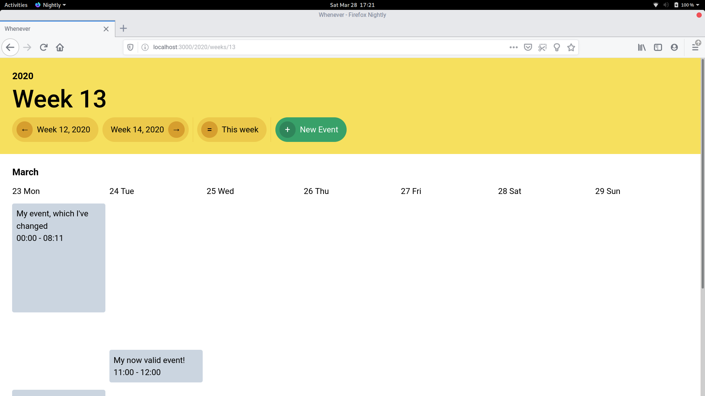

# Whenever

[](https://travis-ci.org/bradparker/whenever)



It's a calendar app written in Rails. If you want your world shook I suspect you want to look elsewhere :)

## Development

Have [Nix](https://nixos.org/nix) and [Docker](https://docs.docker.com/install/) installed. Then enter the Nix shell.

```
$ nix-shell
```

Install the deps

```
$ bundle
$ yarn
```

Start the DB

```
$ docker-compose up -d database
```

Setup the DB

```
$ bundle exec rails db:setup
```

Run the app

```
$ bundle exec rails s
```

Steal youself and open a web browser at [http://localhost:3000](http://localhost:3000).
